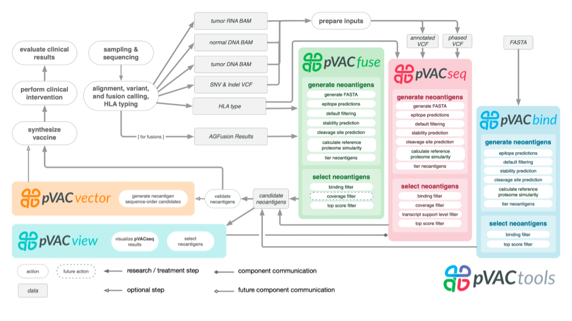

# Introduction

## Motivation

Identification of neoantigens is a critical step in predicting response to checkpoint blockade therapy and design of personalized cancer vaccines. This is a cross-disciplinary challenge, involving genomics, proteomics, immunology, and computational approaches. We have built a computational framework called pVACtools that, when paired with a well-established genomics pipeline, produces an end-to-end solution for neoantigen characterization. pVACtools supports identification of altered peptides from different mechanisms, including point mutations, in-frame and frameshift insertions and deletions, and gene fusions. Prediction of peptide:MHC binding is accomplished by supporting an ensemble of MHC Class I and II binding algorithms within a framework designed to facilitate the incorporation of additional algorithms. Prioritization of predicted peptides occurs by integrating diverse data, including mutant allele expression, peptide binding affinities, and determination whether a mutation is clonal or subclonal. Interactive visualization via a Web interface allows clinical users to efficiently generate, review, and interpret results, selecting candidate peptides for individual patient vaccine designs. Additional modules support design choices needed for competing vaccine delivery approaches. One such module optimizes peptide ordering to minimize junctional epitopes in DNA vector vaccines. Downstream analysis commands for synthetic long peptide vaccines are available to assess candidates for factors that influence peptide synthesis. All of the aforementioned steps are executed via a modular workflow consisting of tools for neoantigen prediction from somatic alterations (pVACseq and pVACfuse), prioritization, and selection using a graphical Web-based interface (pVACviz), and design of DNA vector–based vaccines (pVACvector) and synthetic long peptide vaccines. pVACtools is available at [https://www.pvactools.org](https://www.pvactools.org).

## Target Audience  

The course is intended for anyone seeking a better understanding of current best practices in cancer vaccine design and neoantigen prioritization using pVACtools. It assumes that the learner is familiar with basic biology, genetics and immunology concepts. 

## Curriculum  

This course will teach learners to:

- Understand key concepts of immunogenomics and neoantigen identification
- How to run the pVACtools software suite
- How to visualize and prioritize neoantigen candidates with pVACview

For more background on pVACtools please consult the core pVAC papers [@Hundal2016; @Hundal2018; @Hundal2020].
