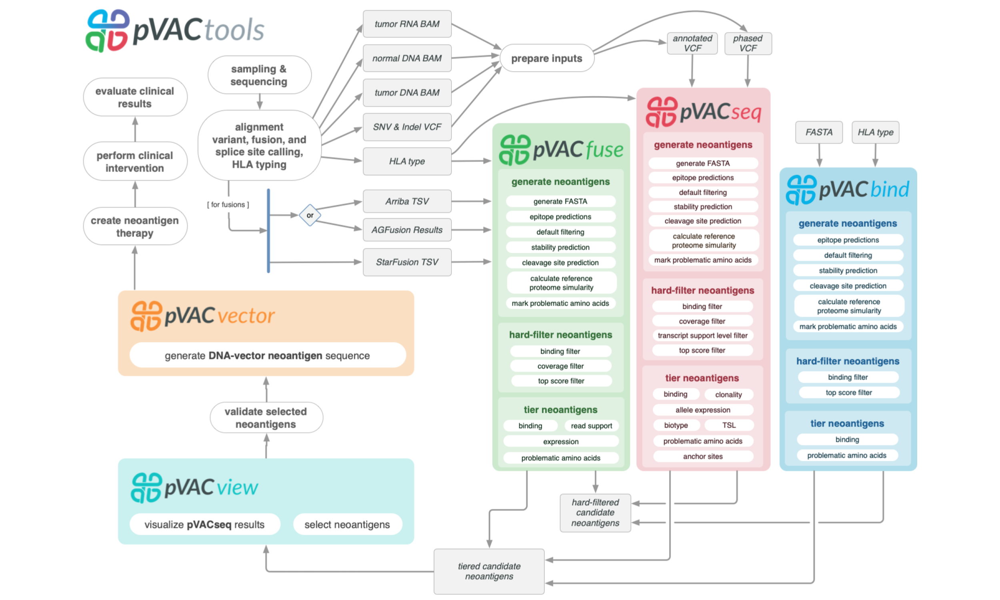
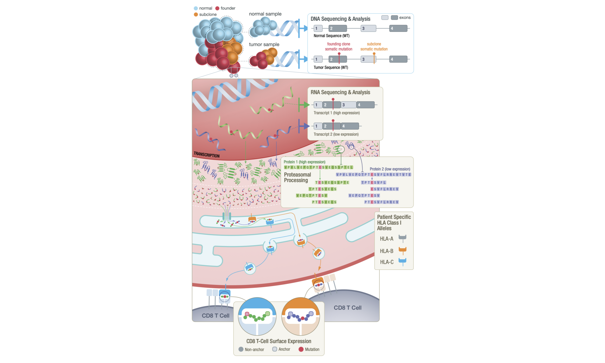

# Introduction

This course has been developed recently (Summer 2023). We welcome any feedback at help@pvactools.org or by submission of [GitHub issues](https://github.com/griffithlab/pVACtools_Intro_Course/issues).

## Motivation

Identification of neoantigens is a critical step in predicting response to checkpoint blockade therapy and design of personalized cancer vaccines.
This is a cross-disciplinary challenge, involving genomics, proteomics, immunology, and computational approaches. We have built a computational
framework called pVACtools that, when paired with a well-established genomics pipeline, produces an end-to-end solution for neoantigen characterization.
pVACtools supports identification of altered peptides from different mechanisms, including point mutations, in-frame and frameshift insertions and deletions,
and gene fusions. Prediction of peptide:MHC binding is accomplished by supporting an ensemble of MHC Class I and II binding algorithms within a framework
designed to facilitate the incorporation of additional algorithms. Prioritization of predicted peptides occurs by integrating diverse data, including mutant
allele expression, peptide binding affinities, and determination of whether a mutation is clonal or subclonal. Interactive visualization via a Web interface allows
users to efficiently generate, review, and interpret results, selecting candidate peptides for individual experiments or patient vaccine designs. Additional modules
support design choices needed for competing vaccine delivery approaches. One such module optimizes peptide ordering to minimize junctional epitopes in DNA vector
vaccines. Downstream analysis commands for synthetic long peptide vaccines are available to assess candidates for factors that influence peptide synthesis. All
of the aforementioned steps are executed via a modular workflow consisting of tools for neoantigen prediction from somatic alterations (pVACseq, pVACfuse, and pVACbind),
prioritization, and selection using a graphical Web-based interface (pVACview), and design of DNA vector–based vaccines (pVACvector) and synthetic long peptide
vaccines. pVACtools is available at [http://www.pvactools.org](http://www.pvactools.org).

## Background

Neoantigens are unique peptide sequences generated from mutations acquired somatically in tumor cells. These antigens provide an avenue for tumor-specific immune
cell recognition and have been found to be important targets for cancer immunotherapies [@Keskin2018; @Ott2017; @Hilf2018]. Effective neoantigens, presented by the
major histocompatibility complex (MHC) and thus introduced to the patient’s immune system, can prime and activate CD8+ and CD4+ T cells for downstream signaling of
cell-death. Patients with high tumor mutation burden tend to have stronger responses to neoantigen based immunotherapy treatments [@Brown2014; @Rizvi2015; @Schumacher2015].
DNA and RNA sequencing technologies allow researchers and clinicians to computationally predict potential neoantigens based on tumor-specific mutations.

However, neoantigen generation and presentation is complex, and a host of factors must be evaluated by complex analyses to characterize each potential neoantigen.
These include but are not limited to: somatic variant identification, tumor clonality assessment, RNA expression estimation, mRNA isoform selection, inference of
translated tumor specific peptides that arise from the somatic variant, and prediction of peptide processing, peptide transportation, peptide-MHC binding, peptide-MHC
stability and recognition by cytotoxic T cells [@Richters2019].

pVACtools can be used as the final step in a well-established variant calling pipeline. It leverages existing tools with functionality related to variant annotation
(Ensembl VEP [@McLaren2016]), identifying neoantigens from specific sources (e.g. fusions via star-fusion [@Haas2019], AGFusion [@Murphy2016], and Arriba [@Uhrig2021]),
HLA typing (OptiType [@Szolek2014], PHLAT [@Bai2018]), peptide-MHC binding prediction (IEDB [@Vita2018], NetMHCpan [@Jurtz2017], MHCflurry [@ODonnell2018],
MHCnuggets [@Shao2020]), peptide-MHC stability (NetMHCstabpan [@Rasmussen2016]], peptide processing (NetChop [@Nielsen2005]), manufacturability
metrics (vaxrank [@Rubinsteyn2017]), and reference proteome similarity (BLAST [@Altschul1990]). Each of these tools tackles specific tasks within the broader goal of
antigen analysis and is utilized by pVACtools to provide an end-to-end integration of novel algorithms and established tools needed to discover, characterize, prioritize,
and utilize tumor-specific neoantigens in basic research and clinical applications. Combining pVACtools with existing variant calling pipelines provides an end-to-end
solution for neoantigen prediction and characterization.

## Target Audience

The course is intended for anyone seeking a better understanding of current best practices in neoantigen identification and prioritization using pVACtools.
It assumes that the learner is familiar with basic biology, genetics and immunology concepts.

## Curriculum

This course will teach learners to:

- Understand key concepts of immunogenomics and neoantigen identification
- How to run the pVACtools software suite
- How to visualize and prioritize neoantigen candidates with pVACview

For more background on pVACtools please consult the core pVAC papers [@Hundal2016; @Hundal2018; @Hundal2020].
