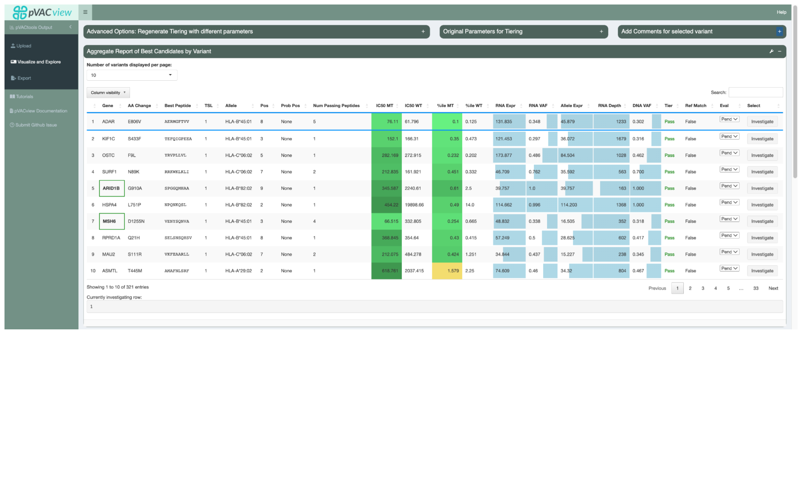

# Tour of pVACview

## Learning Objectives

This chapter will cover:  

- Introduction to the pVACview module
- Demo of the pVACview interface

## Introduction to the pVACview module

pVACview is a R shiny based tool designed to aid specifically in the prioritization and selection of neoantigen candidates for personalized cancer vaccines or other applications. It takes as inputs a pVACseq output aggregate report file (tsv format) and a corresponding pVACseq output metrics file (json). pVACview allows the user to launch an R shiny application to load and visualize the given neoantigen candidates with detailed information including that of the genomic variant, transcripts covering the variant, and strong-binding peptides predicted from the respective transcripts. It also incorporates anchor prediction data for a range of class I HLA alleles and peptides ranging from 8- to 11-mers. By taking all these types of information into account for the neoantigen candidates, researchers will be able to make more informed decisions when deciding final peptide candidates for experiments, personalized cancer vaccines, or T cell therapies designed to target neoantigens.

## Tour of the pVACview interface

Here is a brief tour of the [pVACview](https://pvactools.readthedocs.io/en/latest/pvacview.html){target="_blank"} interface:
 
<iframe src="https://www.youtube.com/embed/SMcXSV1cp1U" width="672" height="400px"></iframe>

